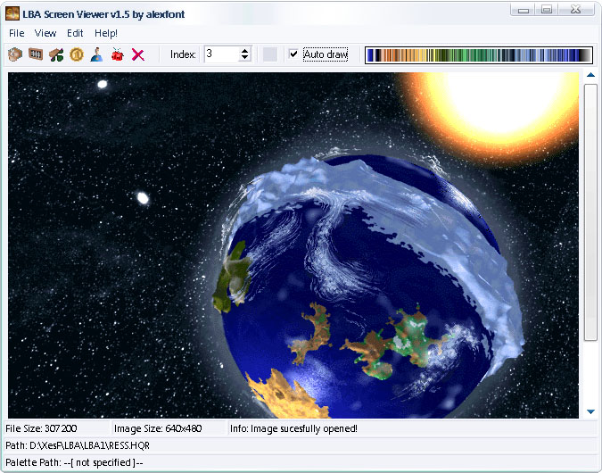
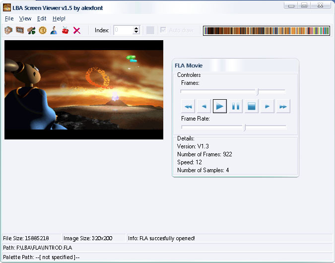

LBA Screen Viewer for Little Big Adventure 1 & 2 images and movies.

* **Latest release:** v1.7 (12.08.2007)
* **Author:** Alexandre Fontoura (@xesf)
* **License:** GNU GPL version 2 or later
* **Developed using:** C++ Builder 6 Professional
* **Original MBN announcement thread:** https://forum.magicball.net/showthread.php?t=8411

This program let you view all special images from LBA1 and LBA2 and save them in the
most common image file formats. You can also view/create the LBA1 `fla` movies
and export them as an animation image. Try and check all the other features ;)

## Open Images

These are the menu sections to open LBA images:

 * Open LBA Resource (`*.hqr`, `*.ile`)
 * Load LBA Image (`*.lim`)
 * Load LBA Brick/Sprite (`*.brk`, `*.lsp`)
 * Load LBA2 Raw Sprite (`*.lsr`)
 * Load LBA2 Saved Game Image (`*.lba`)

### Open LBA Resource

Can open all `HQR` and `ILE` files that contain images.

You just need to open one of them and the first entry will automaticaly be displayed.
To show the other ones you just need to select the entry number and click the **Draw**
button or if the **Automatic_Draw** check box is active you just need to select the entry.

### Load LBA Image (`*.lim`)

Can open a single `lim` file. If the palette is already opened the image will be well displayed.
If the palette isn't loaded, then you can easly drag the palette into the program.

### Load LBA Brick/Sprite (`*.brk`, `*.lsp`)

Can open bricks and sprites from both games.

A popup message will ask you if you want to use LBA2 main palette. Then you just need
to open the brick/sprite file.

### Load LBA2 Raw Sprite (`*.lsr`)

Can open LBA2 raw sprites.

You just need to open the `*.lsp`.

### Load LBA2 Saved Game Image (`*.lba`)

Can open LBA2 saved games.

You just need to open the `*.lba`.

## Convert BMPs to FLA Movies

As a courtesy of Spatarel Dan Constantin (MGLC), you can now create your own FLA Movies
and use them in-game. This little help will guide you to make it happen.

In this help, the term **Keyframe** will be used, so here's an explanation for it.

**Keyframes** are main movie frames in the movie sequence which have a "main palette".
What I mean is that if we create a keyframe, for example the frame number 50, the palette
of the rest frames (deltaframes) will use this same palette. So this means you have to be
careful about the palette the deltaframes will use according with the keyframe.

**Note:** this converter only supports 256 BMP colors, not other formats.

With the converter windown opened, you must first select the BMP files sequence folder.
All the images in the folder must have the same prefix starting from 0. For example
Twinsen0.bmp, Twinsen1.bmp, Twinsen87.bmp, and so on.

Next, you must mention how many frames you will use to create the movie. What
you need to do is simply count all the bmp images and post the number there.
To add addicional keyframes (the first frame is always a keyframe), you must put between
spaces all the keyframes you desire, like `"5 34 44 100 130"`. All the frames between
two keyframes will be treated as a deltaframe as explained above.

You can or not include samples in the movie. This samples are inside flasamp.hqr file.
Note this feature wasn't tested much and it could not work yet as expected. So the
"Sample Index" will be the `hqr` sample index, the "Sample Frequency" the frequency the
engine will play that sound and "Sample Repeat" to know how many times you want to
repeate that sample.

Hope this little FAQ helps you, and all bug reports will be appreciated.

## Import

You can import:

 * LBA Image (`*.lim`)
 * LBA Palette (`*.pal`)
 * Bitmap (`*.bmp`)
 * Jpeg (`*.jpg`)
 * GIF (`*.gif`)
 * PNG (`*.png`)
 * PCX (`*.pcx`)
 * Raw Palette (`*.raw`)

## Export

You can export:

 * LBA Image (`*.lim`)
 * LBA Palette (`*.pal`)
 * Bitmap (`*.bmp`)
 * Jpeg (`*.jpg`)
 * GIF (`*.gif`)
 * PNG (`*.png`)
 * PCX (`*.pcx`)
 * Raw Palette (`*.raw`)

## View

### Full Screen

You can access the Full Screen option by clicking in the submenu **View->Full** Screen.
It can also be enabled by pressing **CTRL+F**.

If a High Quality Resource file (`*.HQR`) is opened and you're seeing it in Full Screen
mode you can change resource indexes by using the shortcut keys **"+"** and **"-"**.

### Settings

Here you can set the file associations. As a default, I've already set the ones I think are
most necessary for this program. Anyway, you can always unset them if you wish ;).

## Other Things

When you open a `lim` file without a palette in the first time, the image will be
displayed incorrectly due to the missing palette. Then if you open an image with the
palette or just the palette itself, a temporary palette would be saved in the
program directory. That way, when you open a `lim` file without the palette the
program will search for this temporary palette and will open the image using it.

## Things TODO

 * Feature to save LBA1 sprites. (not a priority right now)
 * Feature to open the LBA2 SMK movies. (help is welcome)

## Technical Specs
You can find some technical specification files under the `tech-specs` directory.

- [tech-specs/LBAImageFormat.txt](tech-specs/LBAImageFormat.txt)
- [tech-specs/LBAPaletteFormat.txt](tech-specs/LBAPaletteFormat.txt)
- [tech-specs/LBARawSpriteFormat.txt](tech-specs/LBARawSpriteFormat.txt)

## Special Thanks

 * Kazimierz Król (Zink). He helped me so much that I can't even describe.
 * Spatarel Dan Constantin (MGLC) for making the BMP to FLA converter and allowing me to
   integrate it in Screen Viewer.
 * Some ideas/codes taken from the opensource TwinEngine by Vicent Hamm (yaz0r).
 * Palette display idea taken from the Michiel Hendriks (El Muerte) LBA Viewer.
 * For all people that reported bugs and who helped me improve this program.
 * Jakob Alminde (CrazyBee). Because he wanted to be in the credits list :D

### Bug Reporting

 * Ido Beeri (ChaosFish)
 * Kazimierz Król (Zink)
 * João de Camões (OBrasilo)
 * LBAWinOwns
